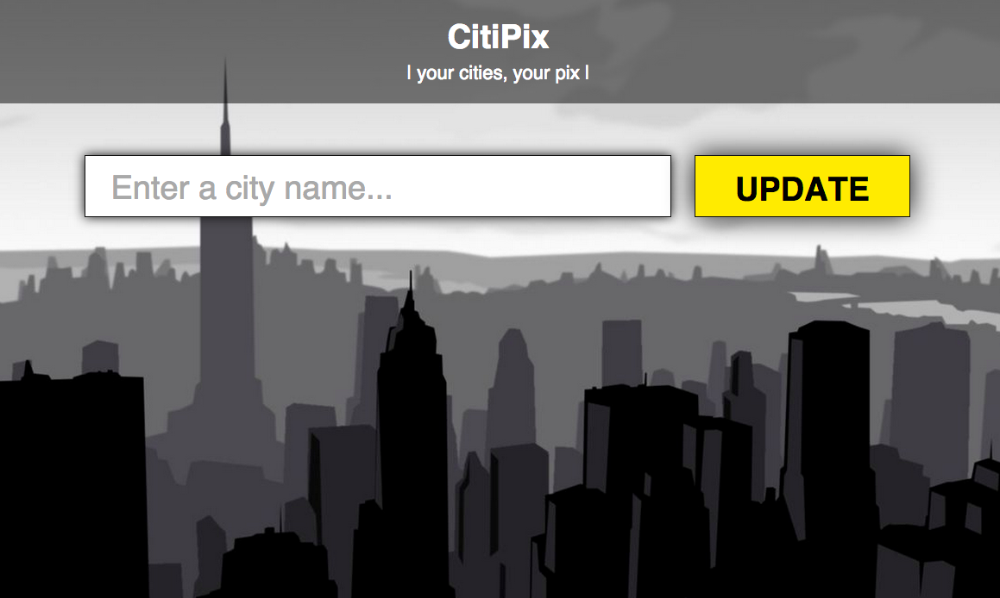
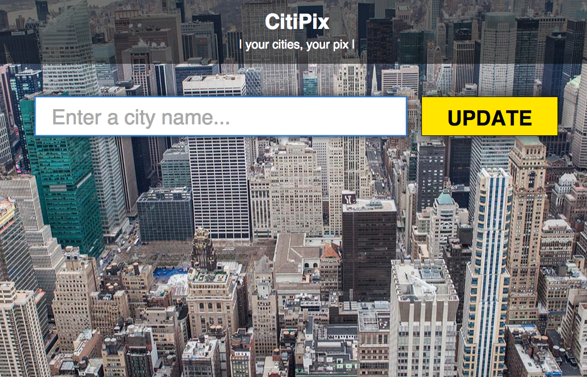

#FEWD Week #5: More JavaScript

---


###Description


JavaScript is powerful: we're able to take user interaction and information and use it to update the page without requiring a refresh. This week, a new startup in your city, CitiPix, is looking to create a personalized picture app that allows users to store pictures they've taken around the world and quickly access them by typing in keywords or tags associated with each photo; they have asked for your help to start building the front-end prototype. You will begin by building a web-app that will take a user's input and update the background image of the page based on that input. Once again, you have been given the starter code that includes the HTML and the CSS. Use the images in the [images folder](starter_code/images) and write JavaScript to make the background image reflect user input based on the Technical Requirements  below.


<br>

---


###Real-World Applications

- Write pseudocode before coding to demonstrate understanding of interactive programming theory and focus on the logic without being distracted by details of syntax
- Write JavaScript code that will update a web-page based on user interaction
- Store user-submitted information in variables to be used throughout an application
- Change DOM elements on the page based on user input
- Specify the order in which your application runs using control flow
- Revisit applications and code you've written to find solutions to problems you've already solved


<br>

---


###Technical Requirements

- Call ```$.val()``` on inputs to get the string value of your user's input
- Store user input in ```var city```
- Use $("form selector").on("submit") or ```$("selector").click()``` to figure out when the user clicks the "submit" button
- Create ```if / else if / else``` conditionals to control the flow of your application
- Write at least six different lines of pseudocode and display them inline as JavaScript comments
- Prevent a form submission using the ```event.preventDefault()``` function
- Use the ```$.ready()``` handler to delay your code from executing until all DOM assets have been loaded
- Get the first element from an attribute name using ```$.attr()```
- Use the ```||``` operator in your conditionals to allow for multiple string values to execute ```if/else if``` statement code
- If a user submits:

  - "New York" or "New York City" or "NYC" make the background of the page nyc.jpg
  - "San Francisco" or "SF" or "Bay Area" make the background of the page sf.jpg
  - "Los Angeles" or "LA" or "LAX" make the background of the page la.jpg
  - "Austin" or "ATX" make the background of the page austin.jpg
  - "Sydney" or "SYD" make the background of the page sydney.jpg

Take a look at what your final product should look like before and after:





After entering "NYC" and submitting:




<br>

---

###Resources

- [Starter Code and Assets](starter_code/)
- [JavaScript docs on comparison operators](http://www.w3schools.com/js/js_comparisons.asp)
- [JavaScript docs on variables](http://www.w3schools.com/js/js_variables.asp)


<br>

---

###Evaluation / Submission

Students should start by using the [starter code](starter_code/) and focus on adding the proper JavaScript to update the background of the page. Students will create a new repository on GitHub called "homework-city" and push their code to it when they are ready to submit. I will provide a numeric grade on a scale for each technical requirement: does not meet expectations (0); meets expectations (1); exceeds expectations (2).

### Bonus Challenges

- Remove extra spaces or new lines that users or the browser might add before or after their input

- Display the correct image regardless of the case the user uses. For example, 'nEw York cIty' or 'New york city' will still work.

- Reset the user input field after it is submitted

- If a user types in an invalid city show `citypix_skyline.jpg` image and display the message "We currently don't have images for this city. Check back later!"

  ​

###Final Project Milestone 1

By 1/23/17, you should have submitted a proposal and wireframes for your final project. Next up, you'll be writing pseudo code for the interactivity you would like to add.  For this week, you should begin writing psuedo code and a draft of the HTML/CSS for your application - this should be turned into your instructor by 2/6/17
